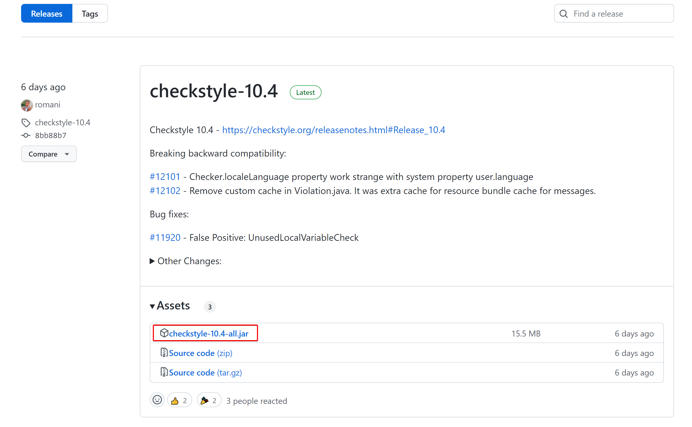
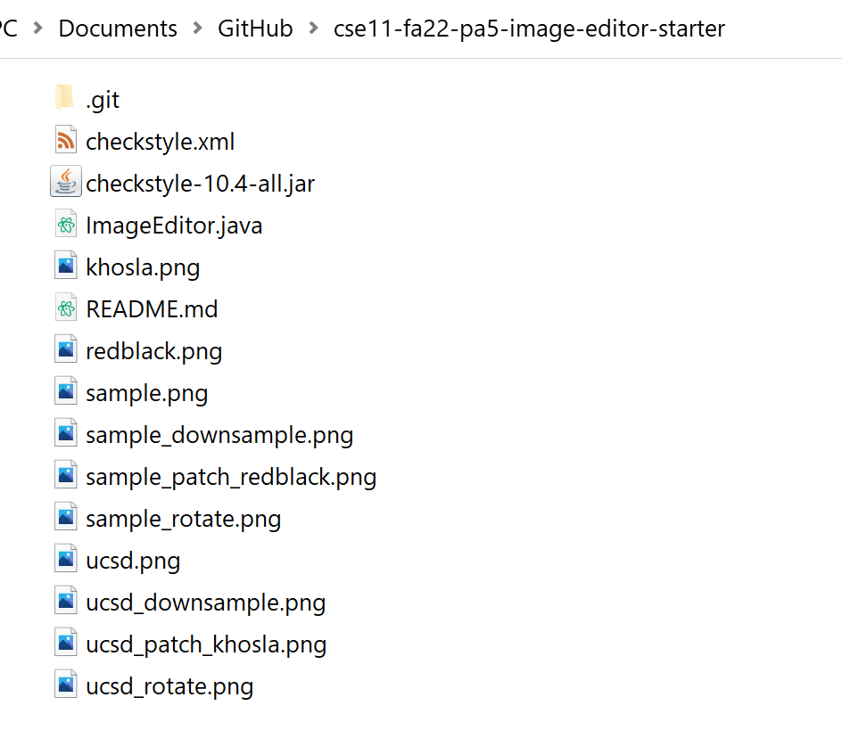
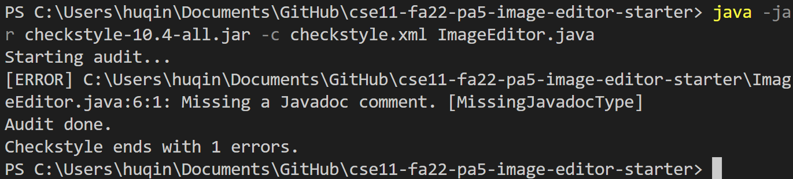

# `checkstyle` for Style Guide
`checkstyle` is a tool to automatically check style issues in your code. Here we provide some `checkstyle` rules in [checkstyle.xml](checkstyle.xml) to help you check for any style issues in your code. 

> **Warning**
> 
> `checkstyle` does not check for all items in our style guide. Passing all our checkstyle rules does not guarantee that you'll get full points on style (but you'll get most of them). Please do follow our style guide and manually check for each item before submission. Here's a non-exhaustive list that `checkstyle` can't check.
> 
> 1. File headers
> 2. Variable names
> 3. Magic numbers for string and char literals
> 4. Short methods

## Running `checkstyle` in Terminal
1. Download the latest release JAR (`checkstyle-10.x-all.jar`) from checkstyle: https://github.com/checkstyle/checkstyle/releases.

2. Download [`checkstyle.xml`](https://github.com/CaoAssignments/style-guide/raw/main/checkstyle.xml) from this repo.
3. Copy both files to the **same** folder where you store your code. 

4. In the terminal, run `java -jar checkstyle-10-x-all.jar -c checkstyle.xml [your java file]` (replace `checkstyle-10-x-all.jar` with the JAR file you downloaded, and `[your java file]` with your source file name). You'll see a list of errors that indicate style issues in your code. 

    
